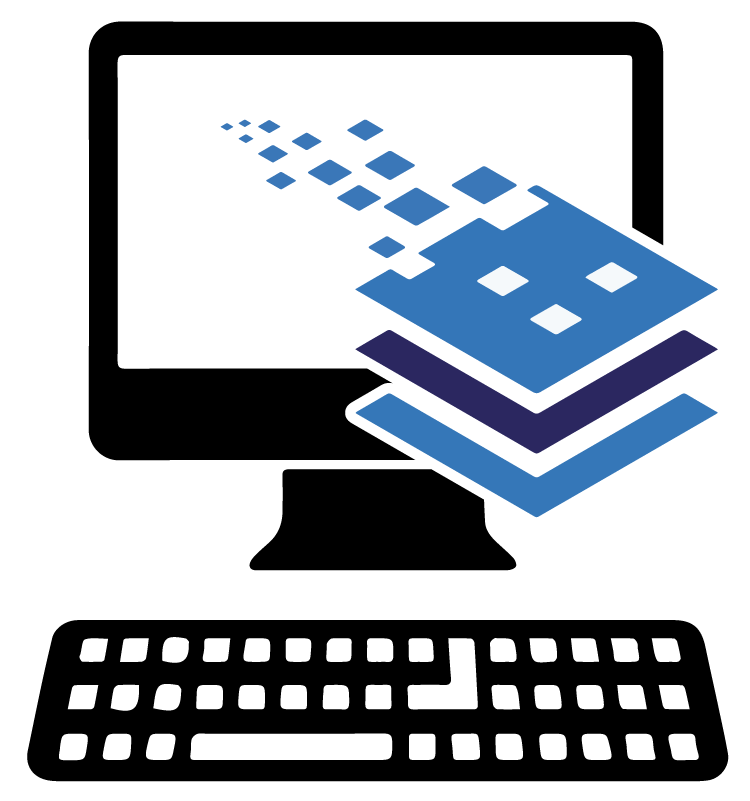

Pets are friends. Moving on from here, I arrived at Georgetown University in Washington DC and immediately became involved in advising and developing data structures for the library archives, learning a lot about Encoded Archival Description (EAD) metadata standards. I also spent a good amount of time helping to enhance the user interface for the library catalog with Javascript. It was during this time I felt like I had a genuine understanding of Javascript and some of the core concepts behind many programming languages. It was exciting to work on a campus with thousands of students and researchers doing important work that depended heavily upon library resources and support for their success. The contributions I made to the online catalog played a small, but at the time an important step in the path of my career.

Lorem ipsum dolor sit amet consectetur adipisicing elit. Placeat necessitatibus facere dolorem perspiciatis illum fugit in cum, ab consequuntur adipisci voluptate hic impedit ipsam molestias quos praesentium culpa, dignissimos consectetur maxime atque veniam eveniet asperiores dolor error. Corporis, debitis fugit? Lorem ipsum dolor sit amet consectetur adipisicing elit. Placeat necessitatibus facere dolorem perspiciatis illum fugit in cum, ab consequuntur adipisci voluptate hic impedit ipsam molestias quos praesentium culpa, dignissimos consectetur maxime atque veniam eveniet asperiores dolor error. Corporis, debitis fugit?
